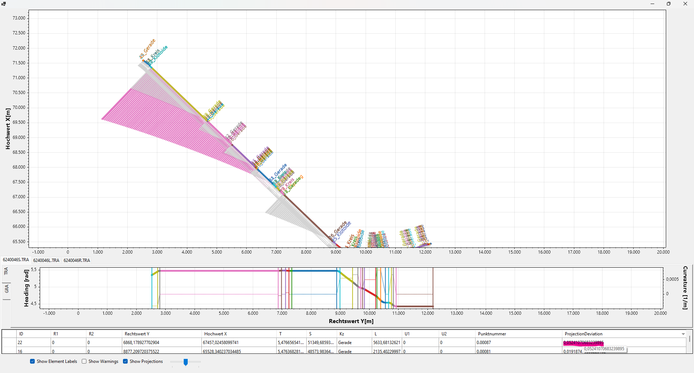
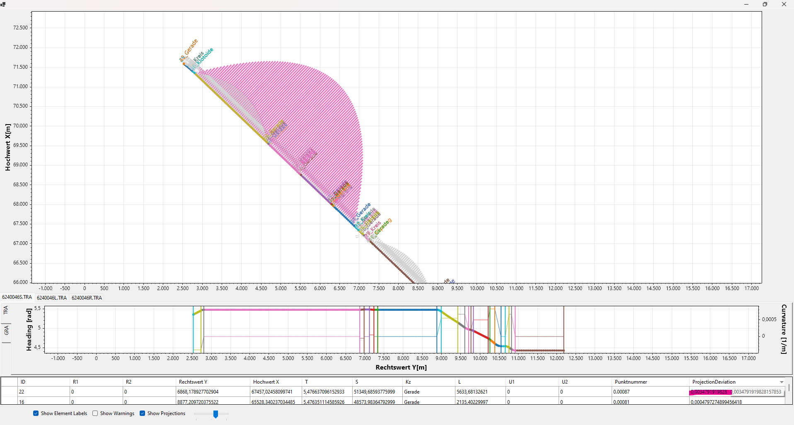

# TRA.Lib

## Description
This repository consists of three projects.
## 1. TRA.Lib:
Library providing Functionality for loading .TRA and .GRA files. If the Library is compiled using the symbol "USE_SCOTTPLOT" it is also providing a detailed visualisation of the loaded data.
### Geometry-Types
TRA-Files consists of a collection of elements. Each element has a underlying Geometry-Type. Currently following Geometry-Types are supported:
- Straight (Gerade)
- Circle (Kreis)
- Clothoid (Klothoid)
- Bloss
- K-Sprung
### Usage
This is done by calling:
```sh
var trasse = Trassierung.ImportTRA(fileName);
var gradient = Trassierung.ImportGRA(fileName);
```
To calculate 2DInterpolation points for a TRA-File call
```sh
trasse.Interpolate(delta, allowedTolerance)
```
providing a delta value as distance between the calculated points. If the resulting polygon would differ more than the allowed tolerance from the geometry, the distance is decreased accordingly.

GRA files are prividing height information related to a station-value S. This station-value is mostly defined in 2D-space via a Station-TRA file (Mileage/"Stationierungsachse"). TRA left/right Files have to be projected to this Station-TRA to retrieve first a value S from the requested 2D Position, and in a second step to calculate a height from the GRA-File on this value S. These relations between the files can be set by:
```sh
trasseL.AssignTrasseS(trasseS);
trasseL.AssignGRA(gradientL);
```
If no trasseS is set the original station-values S are used from the TRA-File and no projection is applied. After the GRA-File is assigned 3D-Points can be calculated by 
```sh
trasse.Interpolate3D(null, 10.0);
```
the fist parameters alows to overwrite/set the TrasseS, if null the previous set is used.
If the library is comiled using the symbol "USE_SCOTTPLOT" the loaded data can be visualized by calling:
```sh
trasse.Plot();
```
Calling this, also inlcludes data of a assigned GRA-File.
Finally exporting the data to CSV is possible by:
```sh
trasse.SaveCSV(StreamWriter);
```
if a interpolation was done before this also includes the Interpolationpoints.

### Settings 
along with the library a settings.json is provided. Editing this allows changes to the tolerances used for warnings. Currently four parameters are available.
```sh
{
  "StationMismatchTolerance": 1E-09,
  "ConnectivityMismatchTolerance": 1E-04,
  "ContinuityOfHeadingTolerance": 1E-08,
  "ContinuityOfCurvatureTolerance": 1E-08
}
```
- StationMismatchTolerance[m]: Tolerance for Station-values; the Station + Length is compared to the successor Station 
- ConnectivityMismatchTolerance[m]: The last point(L)-Position of the interpolation is compared to the successor element coordinates of the TRA-File. A euclidean distance is used for comparison.
- ContinuityOfHeadingTolerance[rad]: The last point(L)-Heading of the interpolation is compared to the successor element heading of the TRA-File.
- ContinuityOfCurvatureTolerance[1/m]: The last point(L)-Curvature of the interpolation is compared to the successor element curvature of the TRA-File.

### Export
the library allows export to .TRA/GRA and .csv. For exporting to TRA different options are available:
- Discard: The scale is ignored, the length retains its original value. This leads to coordinate differences between the geometry elements. The condition station value + L == subsequent element station value is satisfied.
- Multiply: The length is multiplied by scale. The station values of the elements are not adjusted. The condition station value + L == subsequent element.station value is NOT met.
- Add KSprung: The length is multiplied by the scale. To satisfy the condition Stationswert + L == Folgeelement.Stationswert, additional KSprung elements are added where necessary (this mostly results in a TRA-File having KSprung-elements between each geometry). Also a check for Removing KSprung-Elements is done after transform, especially when transformig back to a previous coordinate-system this takes effect.

Export to csv exports a list of all elements, properties and interpolationpoints. Depending on a previous TRA-export scale is already applied to Length parameter, or not if csv-export is done before TRA-export.

## 2.TRA.Lib_TEST:
This project contains Unit-Tests to verify the calculations and functions implemented in TRA.Lib. Results are compared to expected values, especally relevant for interpolations of complex Geometries like Clothoids. Tests are grouped in different categories:
- CoordinateTransformation (Transformation in local Geometryspace)
- ElementEstimation (Get the relevant Element closest to a Point)
- GeometryInterpolation (Interpolation of the different Geometry-Types)
- GeometryProjection (Get a value s on a Gemeotry for a 2D-Point)
- OverallExecutionTest (Test the whole workflow, loading files, interpolate and Plot)
## 3.TRA.Tool
This project provides a executable UI and a simple usage of TRA.Lib.
### Usage
In the explorer to the left, open the folder containig the relevant TRA and GRA files. The UI allows to load a set of files, like they are commonly used, containing TRA -left(L), -right(R), -milage(S) and GRA -left(L), right(R). Simply drag a file to the corresponding textbox, if the naming convention of the other files follows 'xxx[L/R/S].TRA' and 'xxx[L/R].GRA', the other fileds are set automatically. It is also possible to import entire folders, all TRA files are loaded and grouped, if the naming convention allows it. Afterwards a Interpolation can be calculated using the 'Interpolate'-Button (this opens automatically the Plot-View if the included TRA.Lib is compiled with "USE_SCOTTPLOT") and the Result can be exported using the 'SaveCSV' button.

### Transform
Transfromations are currently hardcoded to DBRef_GK5 -> EGBT22_Local more options will be available in future Release.
Resulting changes from Meridian Convergence and Scale Factor are applied to the Element geometries:
#### Meridian Convergence
Delta of Meridian Convergence before and after Transformation is subtracted from original heading
```math
heading_{new} = heading - (γ_{EGBT22} - γ_{DBref}).
```
Only using this approach there remain systematic deviations (52.4mm mean) like in the following image:

Therefore a recalculation of the heading was implemented, which is enabled by default using "Optimize Heading". \
$$X_i,Y_i$$ coordinates calculated from Geometry at end \
$$γ_i = \text{atan2}(X_i - X_{element}, Y_i - Y_{element})$$ heading by geometry \
$$γ_t = \text{atan2}(X_{successor} - X_{element}, Y_{successor} - Y_{element})$$ heading from element to successor element \
$$heading = heading - (γ_t - γ_i)$$\
Applying that, the deviation can be reduced significantly (3.4mm mean), remaining only minor deviations as for example a straight line does not mandatory remain a line after transformation (especially for long elements in that case 5633m) as following images shows:

The example shown in the image is a mileage TRA-element, so its deviation is not that important. Usually L & R TRA-elements are way shorter, reducing this effect. Again that effect affects above all straight elements but along with shorter element lengths the mean deviation reaches max 0.7mm in the Test-Dataset.
#### Scale
Scale is applied as follows:
- to the Length parameter as mean of Scale at elements start- & endpoint
- to r1 & r2 of a circle geometry as mean of Scale at elements start- & endpoint
- for Bloss & Klothoid r1 is multiplied by scale at element start and r2 is multiplied by scale at element end

Only changing Length parameter by Scale resulting from Transforms Scale Factor left significant deviations. Similar to the Heading optimization, a length optimization is available and enabled by default. 

